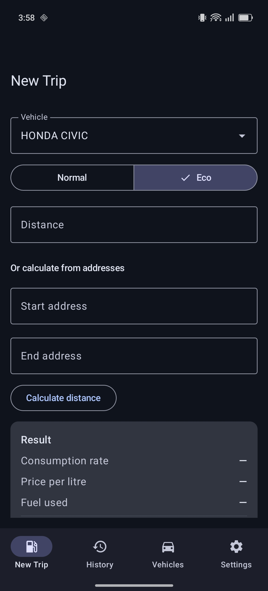
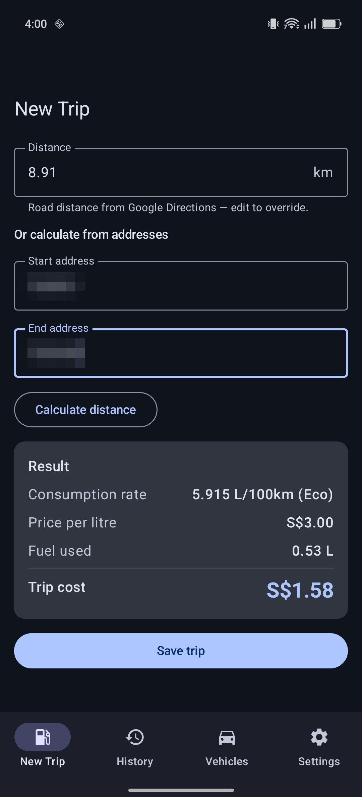
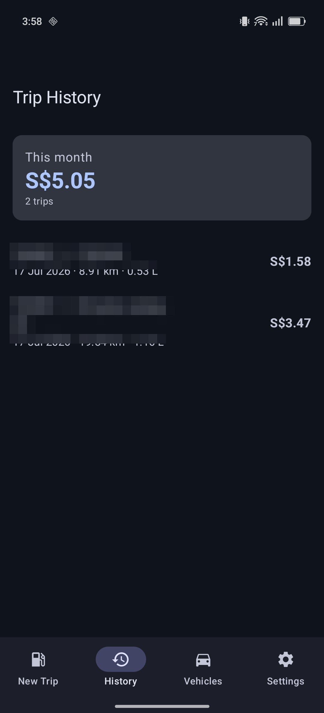

# Cost Per Trip

[](https://github.com/moleicafe/trip-cost-calculator/actions/workflows/ci.yml)

**A native Android app that tells you what any car trip actually costs in fuel — from your
vehicle's real consumption rate, the trip distance, and what you pay at the pump.**

Built for everyday drivers who think in "how much did that trip cost me?" rather than
litres: set up your vehicle once (consumption, tank size, what a full tank costs), then get
a live cost read-out for every trip as you type. Distance can be entered manually or looked
up as true road distance between two addresses via the Google Maps Directions API.

> ✅ **Status:** Core flow verified end-to-end on a physical device — vehicle setup,
> Directions-API distance lookup, live calculation, trip history, and month totals all
> working (see screenshots). All 10 unit tests pass, including the calculation-engine
> acceptance case. Next up: electric-vehicle support, then CSV export, spend charts,
> CO₂-based entry, and km/L display.

## Features

- **Per-trip cost, live** — the result card (rate used, price/L, litres, cost) recomputes
  on every keystroke, not on submit.
- **Vehicle profiles** — normal + eco consumption (eco can auto-derive from a configurable
  saving %), tank capacity, fuel price per full tank *or* per litre, per-vehicle currency.
- **Real road distance** — optional address-to-address lookup via the Google Directions
  API. No key? Entry stays manual: the app refuses to substitute straight-line estimates,
  which under-read road distance by ~7% in testing.
- **Trip history** — newest first with a running total for the current month.
- **Trip detail** — every formula shown with the trip's actual numbers substituted, so the
  arithmetic is auditable.

## Screenshots

Running on a physical device (Singapore trips, per-litre pricing, eco mode):

| New Trip | Live result + Directions lookup | Trip History |
|:---:|:---:|:---:|
|  |  |  |

## Tech stack

Kotlin · Jetpack Compose (Material 3) · Room · DataStore · Retrofit · ViewModel + StateFlow
· Navigation Compose · JUnit

## The formulas

| # | Value | Formula |
|---|-------|---------|
| 1 | pricePerLitre | `fuelPricePerTank / tankCapacityLitres` (skipped in per-litre mode) |
| 2 | consumptionRate | `mode == Eco ? consumptionEco : consumptionNormal` |
| 3 | fuelUsedLitres | `distanceKm × consumptionRate / 100` |
| 4 | cost | `fuelUsedLitres × pricePerLitre` |
| 5 | consumptionEco (auto) | `consumptionNormal × (1 − ecoSavingPercent / 100)` |

Calculations keep full double precision; rounding (2 dp, HALF_UP) happens only at display.

## Getting started

**Prerequisites:** Android Studio (Ladybug or newer), JDK 17, an Android device/emulator on
API 26+.

1. Clone and open the project folder in Android Studio.
2. Sync (the Gradle wrapper pins 8.9) and run the `app` configuration.
3. *(Optional)* For address-to-address distance, create a Google Cloud API key with the
   **Directions API** enabled and paste it into the app's **Settings** screen. The key is
   stored on-device in DataStore — it never appears in source or leaves the device except
   to call Google's API.

## Validation gate

```
gradlew :app:testDebugUnitTest
```

`FuelCalculatorTest` reproduces the acceptance case — Honda Civic 1.6 VTi CVT
(6.7 / 6.1 L/100km, 47 L tank, $100 per tank), 21 km trip in eco mode — and requires
**1.28 L** fuel used and **$2.73** cost exactly at display precision (price/L = $2.13).
`DirectionsParsingTest` covers the Directions API response parsing.

## Architecture

```
domain/FuelCalculator.kt   pure Kotlin — all five formulas, no Android deps (unit-tested)
data/                      Room (Vehicle, Trip), DataStore settings, Retrofit Directions client
ui/<feature>/              one ViewModel (StateFlow, live recombination) + screen per feature
MainActivity.kt            NavHost + bottom navigation (New Trip · History · Vehicles · Settings)
```

## License

[MIT](LICENSE)
